# Developer Guide - Data Search

## Overview:
Please click the below image on the area of interest, to jump to that section of the document.
 
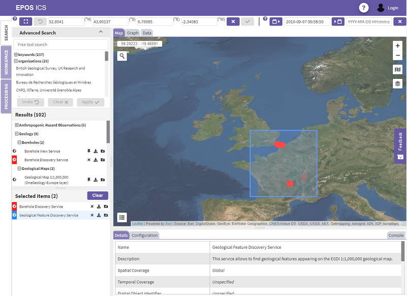

<map name="full-screen-map">
  <area shape="rect" coords="25,30,800,50" href="#spatial-temporal-controls" alt="Spatial-Temporal Controls" title="Spatial-Temporal Controls">
  <area shape="rect" coords="25,55,215,215" href="#advanced-search" alt="Advanced Search" title="Advanced Search">
  <area shape="rect" coords="25,215,215,365" href="#search-results" alt="Search Results" title="Search Results">
  <area shape="rect" coords="25,375,215,580" href="#selected-items" alt="Selected Items" title="Selected Items">
  <area shape="rect" coords="740,0,790,30" href="#logging-in" alt="Logging In" title="Logging In">
  <area shape="rect" coords="223,55,800,447" href="#visualization-panel" alt="Visualization Panel" title="Visualization Panel">
  <area shape="rect" coords="223,455,800,580" href="#bottom-panel" alt="Bottom Panel" title="Bottom Panel">
</map>

## Spatial-Temporal Controls:

The spatial and temporal controls allow the user to define a default geographical area and/or period of time.  Setting values in these controls trigger updates to:  
- The results displayed in the [Search Results](#search-results) panel.
- The facets that are available for selection in the [Advanced Search](#advanced-search) panel.
- Any [Selected Items](#selected-items) that have spatial or temporal configuration parameters, which are not overridden in the [Configuration Panel](#configuration-panel).  See the [Configuration Panel](#configuration-panel) section below for how this can result in updates to the visualization area.

#### Spatial Control
[SpatialControlsComponent](../../components/SpatialControlsComponent.html)  
The spatial control allows the user to define a default geographical area to focus their data discovery efforts on.  They can do this by either manually entering the latitude and longitude of the bounding box extents using the input fields, or by drawing an area on the map.

Buttons  
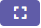: Triggers the ability to draw a bounding box on the map.  
: Resets the input fields to the previously defined bounding box extents.  
: Accepts a manually defined bounding box  
: Clears the current bounding box.  

#### Temporal Control
[TemporalControlsComponent](../../components/TemporalControlsComponent.html)  
The temporal control allows the user to define a default period of time to focus their data discovery efforts on.  They can do this by either manually entering the dates/times in the input fields, or by using the date-pickers provided.

Buttons  
: Displays the "from" date-picker.  
: Displays the "to" date-picker.  
: Clears the current dates.  
  

## Advanced Search:
[AdvancedSearchPanelComponent](../../components/AdvancedSearchPanelComponent.html)  
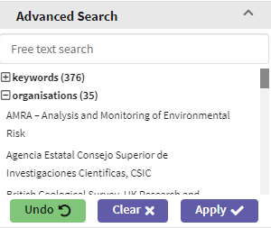

The advanced search panel is designed to allow a user to further filter their search results.  Having primarily been given the option to search by time and location (using the [Spatial-Temporal Controls](#search-temporal-controls)), the user can now input text into the free-text search field and select from pre-defined keywords and organisations to further refine the results that they see.  Upon doing this and pressing the "Apply" button, the following areas are updated to reflect the new criteria:  
- The results displayed in the [Search Results](#search-results) panel.
- The facets that are available for selection in the [Advanced Search](#advanced-search) panel.

## Search Results:
[DataResultsComponent](../../components/DataResultsComponent.html)  
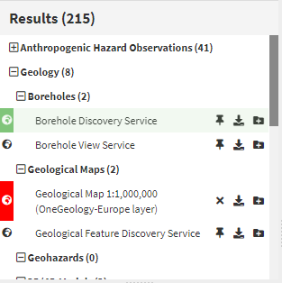

The search results displays all of the results that are generated from the search criteria in the [Spatial-Temporal Controls](#search-temporal-controls)) and [Advanced Search](#advanced-search) panel.  The results are organized into a hierarchy, grouping similar results under collapsible domain headings.  

Each individual item is displayed as a [Result Item](#result-item).

The screen area used to display the search results is partly shared by the [Advanced Search](#advanced-search) panel, so fewer results will be visible if the [Advanced Search](#advanced-search) panel is expanded.

## Selected Items:
[DataSearchPinnedItemsComponent](../../components/DataSearchPinnedItemsComponent.html)  
###### (Pinned Items)
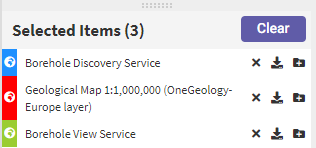

This panel contains all of the results items that a user has previously selected in the [Search Results](#search-results), using the "Select" (pin icon) action.

Items are displayed as [Result Item](#result-item)s and are all displayed in the [Visualization Panel](#visualization-panel) if they are able to be visualized.

A "Clear" button in the panel title area allows all of the selected items to be removed at once.

A draggable bar separating this area from the [Advanced Search](#advanced-search)/[Search Results](#search-results) area allows a user to change the height of these panels, depending on what they need to see more of.

## Result Items:
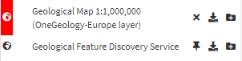

Each result item is displayed with:
- a unique colour, which allows a user to more easily associate an item with data visualized in the [Visualization Panel](#visualization-panel).
- icon(s) to indicate what kind of data visualization is available (see [Visualization Panel](#visualization-panel) for details).
- a short description.
- clickable icons that trigger actions.

Clicking on an item:
- Temporarily selects it and updates the [Bottom Panel](#bottom-panel) to display the selected details and configuration.
- Visually highlights it.
- If there is a corresponding item in another panel, that is also selected.

Each result item has default configuration parameters associated with it, that can be overridden in the [Bottom Panel](#bottom-panel) [Configuration Tab](#configuration-tab).  This will affect the data that is associated with this item.

Icons/actions:  
: Select - Adds that item to [Selected Items](#selected-items).

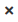: De-select - Removes the item from [Selected Items](#selected-items).

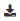: Download - Allows the user to select which format to download data in.

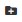: Add to Workspace - Allows the user to select which workspace to add the configured item to.  (The user must be logged in).

## Logging In:
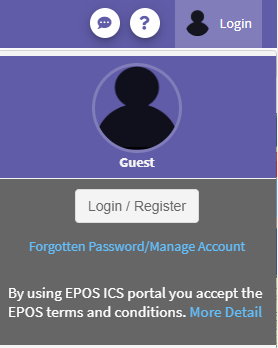

The login icon at the right side of the header bar activates a drop-down menu allowing a user login, logout, and access forgotten password functionality etc.  A logged in user can access the workspace page and add items to their workspaces, allowing them to build up groups of configurable data items that can be used in the future.

The login process involves navigating the browser window to our authentication provider, then later being redirected back to the current page.

## Visualization Panel:
[DataVizualizationComponent](../../components/DataVizualizationComponent.html)  
All of the [Result Item](#result-item)s added to the [Selected Items](#selected-items), plus the one that is temporarily selected in the [Search Results](#search-results) are available for display in the visualization panel.  This panel is designed to allow the user to quickly investigate the data associated with the search results, in order to help them decide whether to add them to a workspace for further more in-depth analysis.

Each tab in this panel displays data in a different way and will only attempt to display a (potentially overridden) configuration of a [Result Item](#result-item) if it is available in a format that is suitable.

| Icon | Visualization Tab | Formats |
| :-|:-| :-|
| globe | [Spatial](#spatial-visualization-tab) | [Formats](../../classes/DistributionFormatType.html#mappableFormats) |

###### Developer Links:  
[Mappable Formats](../../classes/DistributionFormatType.html#mappableFormats)
[Graphable Formats](../../classes/DistributionFormatType.html#graphableFormats)

#### Spatial Visualization Tab:
[DataVizualizationMapComponent](../../components/DataVizualizationMapComponent.html) 
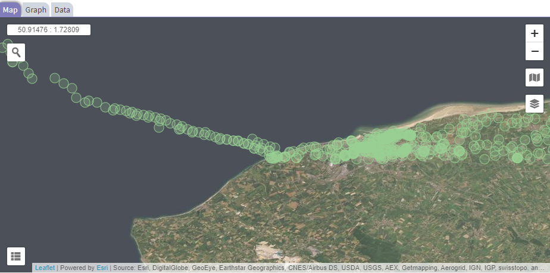

This is a tab for displaying [Result Item](#result-item)s with data that has a geographical component.  It consists of a scrollable, zoomable map with search, layer toggle, and basemap controls.  It also displays a the latitude and longitude of the curser as it hovers over the map and a legend for each map layer that supports the generation of one.

Where the [Result Item](#result-item) supports the [EPOS flavor of GeoJSON](../epos-geojson.html), any generated markers will take into account the unique color that has been assigned to it, and the custom styling defined in the data.

## Bottom Panel:
[BottomPanelComponent](../../components/BottomPanelComponent.html)  
#### Details Tab:
[DataDetailsTableComponent](../../components/DataDetailsTableComponent.html)  
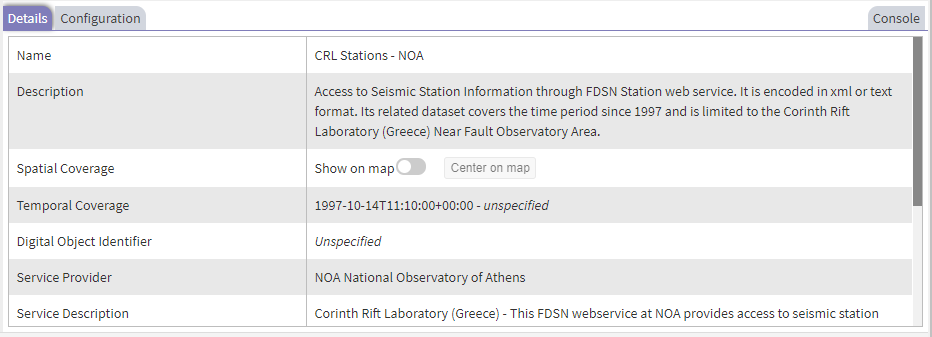

The details tab contains details of the [Result Item](#result-item) currently selected in the [Search Results](#search-results).

If spatial coverage information is available a toggle control is added to the details that (once activated) shows an outline of the coverage area on the map in the [Spatial](#spatial-visualization-tab). There is also a "Center on map" button to scroll/zoom the map to show this coverage clearly.

Where available, links are also displayed for easy access to licensing and documentation information associated with the data.

#### Configuration Tab:
[DataConfigurationComponent](../../components/DataConfigurationComponent.html)  
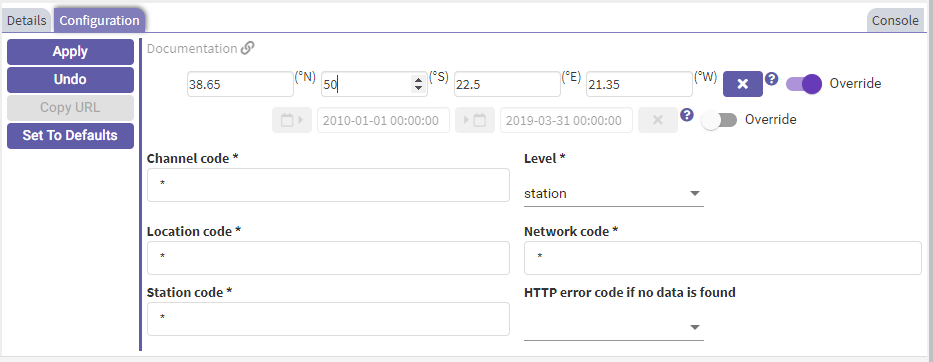

Like the details tab, the configuration tab is driven by the selection of the [Result Item](#result-item) in the [Search Results](#search-results).  Its purpose is to allow a user to manipulate the parameters that are used to retrieve the data from that [Result Item](#result-item).  This affects the download of data, how it is visualized, and the parameter values that persist when a user adds an item to their workspace.

Most parameters are drop-down menus of allowed values, text or number fields, but items that contain a spatial or temporal component may have a corresponding control that optionally overrides the similar [Spatial-Temporal Controls](#search-temporal-controls) at the top of the page.

#### Console Tab:
[DataConsoleComponent](../../components/DataConsoleComponent.html)  
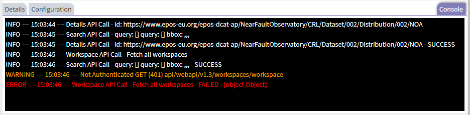

This is a console-type panel that logs out the calls made by the UI to the webAPI, so that a user can review it and find where problems may have occurred.
