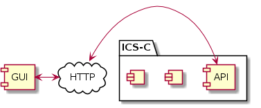
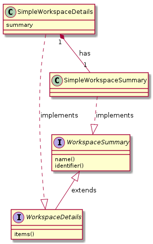

# GUI: Module Design  
## Introduction  
### Purpose  
The intended audience of this document are developers that intend to contribute to the EPOS GUI or need to know details in order to build and deploy the GUI.

The aim of the document is to capture enough detail as to aid developers and maintainers in their understanding of the structure and principles employed during the development of the GUI.

### Scope  
The scope of the document is limited to the EPOS GUI and it's interactions with the core EPOS ICS-C system via the EPOS Web API (link required).

Created with: [LiveUML](https://liveuml.com) source [file](files/scope.txt)
### References  
| Reference  | Document                                                     |
| ---------- | ------------------------------------------------------------ |
| ICS-C-Arch | ICS-C Architecture https://epos-ci.brgm.fr/epos/devops-documentation/blob/master/ics-c_architecture.md |
| WebAPI     | Web API project https://epos-ci.brgm.fr/epos/WebApi       |
|            |                                                              |

## Module Description  
### Module Overview  
EPOS is a system for the discovery, visualisation and ultimately the process of earth-science data. The GUI module represents the primary interface end-users will use to interact with the system.

### Significant Requirements  
The requirements for the GUI have undergone significant, repeated and arbitrary change throughout the implementation phase of the EPOS project. The requirements below represent high-level behaviours that most influence the design of the GUI module and were required by the end of the implementation phase (September 2019).

#### API

The user interface is to be considered stateless, all data and actions requiring persistence will be via the EPOS Web API. The EPOS Web API uses the HTTP as a method of communication. 

#### Discovery

##### Search

Allow the user to search for resources held within the metadata catalogue of the ICS-C system, the user should be able to populate fields that will enable the search results to be filtered.

Required filters:
* spatio coordinates
* temporal coordinates
* organisation
* keywords
* free text

##### Explore

Allow the user to 'explore' the resources (resulting from the search) either individually or conjunction with one-another. the primary method of exploring results is via a multi-layered map visualisation (other visualisation s to be added later).

* Map visualisation, supports a variety of layer types, legends, layer controls. CRS: WGS84 / EPSG4326
* Time Series visualisation (out of scope for September 2019)
* Data Table visualisation (out of scope for September 2019)

##### Reconfigure

Allow the user to see and potentially reconfigure the 'configuration' used to access the data of a resource.

##### Download

Allow the user to download a copy of the data obtained by 'executing' the 'configuration' associated with a resource.

##### Persist

When the user discovers a resource allow them to persist it for future use.

#### Workspace

The requirements for the workspace have been largely descoped for September 2019, it will still be present and offer many of the same visualisation and reconfiguration features as the discovery page, except it there is no search, the only resources that are available are those that have been added to the currently selected 'workspace'. Resources are added to a workspace via the **persist** behaviour of the **discover** phase.

#### Processing

Not required for September 2019

### Design Principles  

#### SPA

After extensive analysis it was decided to create the EPOS GUI as a Single Page Application (SPA) using the  [Angular](https://angular.io/) web framework and the associated, application scale, javascript superset language [Typescript](https://www.typescriptlang.org/).  

#### Stateless

The SPA is essentially stateless, being stateless it can be served by any webserver (inside or outside of docker). All data and actions requiring persistence will be via the EPOS HTTP Web API (the API is beyond the scope of this document).

#### Angular Services

TBD

#### Composition over Inheritance

> Composition over inheritance (or composite reuse principle) in object-oriented programming (OOP) is the principle that classes should achieve polymorphic behaviour and code reuse by their composition (by containing instances of other classes that implement the desired functionality) rather than inheritance from a base or parent class.

https://en.wikipedia.org/wiki/Composition_over_inheritance

##### API Functional Areas

The EPOS Web API offers a number of area of functionality, for example: search, workspaces etc. Within the GUI code the Web API is modelled a modelled as separate classes that correspond to these functional areas, allowing a composite representation of the Web API to be constructed from them. This allows for functional areas to maintain separation, thereby easing maintenance, refactoring, testing etc.

##### API Payloads

Many of the payloads returned from the Web API a representation of the same conceptual object, just with different degrees of granularity. For example a call to the API may return a list of workspaces, another call may return the details of a specific workspace, the distinction between these two representations is that  first is just a summary where as the second is the details - but the details also include everything from the summary.

Created with: [LiveUML](https://liveuml.com) source [file](files/composition.txt)

### Quality Attributes  
_Explanatory notes: the qualities that have been prioritised, for example they could be: performance, stability, usability, maintainability, this list goes on..._

### Constraints  
_Explanatory notes: restrictions placed on the architecture/design, should any of the constraints change in the future the architecture/design may need to be revisited_

### Assumptions  
_Explanatory notes: the circumstances under which the architecture/design is to be considered valid, should any assumptions be proven false in the future the architecture/design may need to be revisited_

 

CRS: WGS84 / EPSG4326

Everything from the API

User will not want to search when on workspace or other non-discover pages

The API will inform the GUI of all the data formats available for a resource in such a way that the GUI can determine all appropriate behaviours to exhibit for that data.

 

### Technologies  
_Explanatory notes: the core technology choices and the reason why the have been selected, what is also useful to capture is why alternatives were not selected_

 

Languages: Typescript, Javascript, CSS, HTML

Framework: Angular

Material

Leaflet

Node NPM

GitLab

Docker

k8

html

css

js

 

## Module Interface  
### API Overview  
Given that the GUI module is a user interface it does not have a programmatic public API.

### API Definition  
Not applicable

### Storage Mechanisms and Network Protocols  
_Explanatory notes: summarise what data/messages in consumed or exposed by the PUBLIC API and what protocols or storages mechanisms used_

#### Feature: API  
#### Feature: Authentication  
#### Feature: Search  
#### Feature: Data Model  
#### Feature: Metadata  
#### Feature: Workspaces  
#### Feature: Configurations  
#### Feature: Service Execution  
#### Feature: Console Logging  
#### Feature: Supported Payloads  
#### Feature: Visualisations  
#### Feature: etc.  
### Error Handling  
_Explanatory notes: provide information on how errors manifest themselves through the PUBLIC API_

### Logging  
_Explanatory notes: provide information on how logging is carried out and can be accessed/aggregated_

## Module Design  
_Explanatory notes: captures the core concepts, abstractions, entities, sub-components needed to fulfil the purpose and API of the module, please note 'less is more' it should include enough information to useful, but not som much detail that it quickly becomes out-dated_

### Overview  
### Logical  
_Explanatory notes: captures the logical design of the module features - how it's implemented, i.e. classes and interfaces_

... it is fair to say that due to the constant changing of requirements, the codebase has evolved into its current state, rather than being designed this way...

#### Feature: API
This handles all API module interactions that the GUI needs to perform.  Its workflow can be summarised as:
- accept criteria from GUI sub-modules
- form the correct request, adding authentication information as required
- perform the required http request to the API module
- validate the respose
- display error notification (if required)
- process response data into internal objects
- return the appropriate response to the calling GUI sub-module
#### Feature: Authentication
Users who log in are able to access extended GUI features, including Workspaces.  They may also see otherwise inaccessible search results.
#### Feature: Search  
This feature uses the following user input parameters to perform a search of distributions:
- spatial area
- temporal range
- free-text
- keywords (from a pre-defined list)
- organisations (from a pre-defined list)

The GUI takes the selected parameters, calls the API search endpoint, then displays the returned results in the hierarchy structure that is returned.

#### Feature: Data Model
The data model is a single point of truth for various data items within the GUI module.  When a model item is updated, anything that depends that item s notified of the change.
#### Feature: Metadata  
#### Feature: Workspaces  
A workspace is a collection of configured distributions (configurations).  In the GUI, an authenticated user can view and manipulate this collection of configurations in isolation.
#### Feature: Configurations  
Configurations are instances of distributions that also contain configured parameter values.
#### Feature: Service Execution  
#### Feature: Console Logging  
#### Feature: Supported Payloads  
#### Feature: Visualisations  
#### Feature: etc.  
### Dynamic  
_Explanatory notes: captures the dynamic interactions and communication between, especially if there is a concurrency aspect_

#### Feature: API  
#### Feature: Authentication  
#### Feature: Search  
#### Feature: Data Model  
#### Feature: Metadata  
#### Feature: Workspaces  
#### Feature: Configurations  
#### Feature: Service Execution  
#### Feature: Console Logging  
#### Feature: Supported Payloads  
#### Feature: Visualisations  
#### Feature: etc.  
### Storage Mechanisms and Network Protocols  
_Explanatory notes: describe what data in consumed by the module and produced by the module, including internal and external formats (reference other pages/sites as required for details)_

#### Feature: API  
#### Feature: Authentication  
#### Feature: Search  
#### Feature: Data Model  
#### Feature: Metadata  
#### Feature: Workspaces  
#### Feature: Configurations  
#### Feature: Service Execution  
#### Feature: Console Logging  
#### Feature: Supported Payloads  
#### Feature: Visualisations  
#### Feature: etc.  
### Code  
_Explanatory notes: where the code is stored (link to GitLab repo), the structure of the repo (where functional code is, where tests are, location of configuration files, where 'other' files are located, etc.)_

## Testing  
_Explanatory notes: describe the how the module has been designed with testing in mind, the testing strategy: unit/integration etc._

## Deployment  
_Explanatory notes: describe how the module is built, packaged and is incorporated into the system_

------
