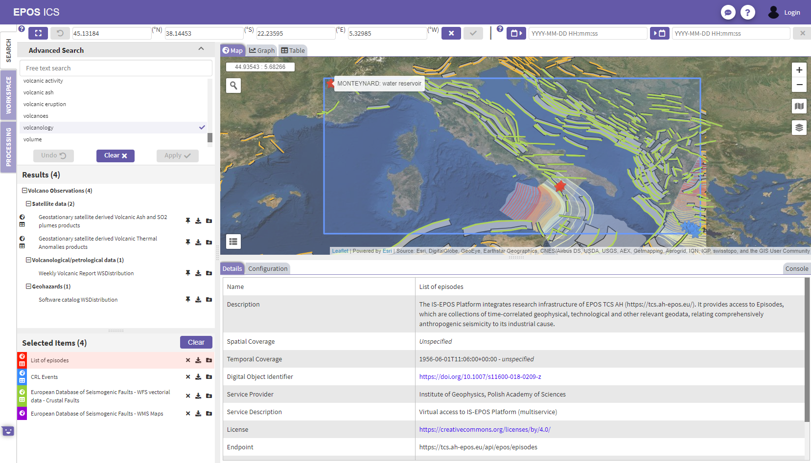
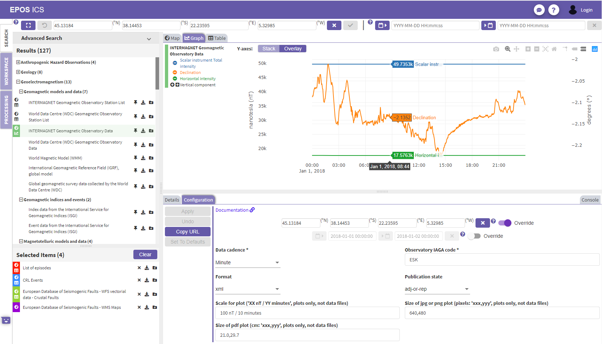

## EPOS ICS-C portal
The EPOS ICS-C portal is a Graphical User Interface ([GUI](https://www.epos-ip.org/glossary/gui)) that provides the gateway for users to the EPOS Research Infrastructure. It has been validated against use cases collected throughout the EPOS-IP, where each [TCS](https://www.epos-ip.org/glossary/tcs) group provided several user stories. The user stories were analysed, and the GUI reflects the features requested by the TCSs. The ([GUI](https://www.epos-ip.org/glossary/gui)) is fully integrated to the [[ICS Architecture scheme](https://epos-ip.org/data-services/ict-architecture/ics-architecture)]. Work continues to mature the portal’s robustness and functionality, using further user feedback to ensure that the product suits both the original and developing requirements.

Currently, a user can discover datasets of interest by identifying:
- a geographical area
- a period of time
- associated organisations
- pre-defined keywords
- user input free text

The returned search results contain sources of data that match the search criteria.  With each of these results a user can:
- read a detailed overview of the data available
- download the data in any of the available formats
- view a time-series plot on a graph (if the data is suitable)
- display geographical data on a map (if the data is suitable)
- view the data in tabular form (if the data is suitable)
- configure the data source access by adjusting parameters, allowing a dataset to be retrieved that better suits the user's purpose
- (if the user is authenticated) add this configured data-source to a persisted workspace, for later use

The GUI is currently hosted at: https://www.ics-c.epos-eu.org/

